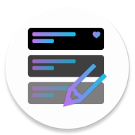

<!--
**** Shoutout to othneildrew for the amazing readme template!
-->

<!-- PROJECT LOGO -->

 

  

  <h1 align="center">Quicklyα</h1>

  

    Note taking app for Android with clean UI
     
    <a href="https://github.com/ttomovcik/quickly/wiki"><strong>Download »</strong></a>
     
     
    <a href="https://github.com/ttomovcik/quickly/">Google Play</a>
    ·
    <a href="https://github.com/ttomovcik/quickly/issues">Send a bugreport</a>
    ·
    <a href="https://github.com/ttomovcik/quickly/issues">Request a new feature</a>
  

* [About](#about)
* [Getting started](#getting-started)
* [Contact](#contact)

# About
Quickly is a note taking app for Android with clean UI. Still in alpha tho. Feel free to send FR.

# Getting started
There's no getting started. Just compile it ;)

# Contact
Project author:  **Tomáš Tomovčík**
* [Github](https://github.com/ttomovcik)
* [Facebook](https://facebook.com/ttomovcik)
* [Twitter, idk, it doesn't work](https://twitter.com/@ttomovcik)
* [Spicy nudes](https://www.instagram.com/_ttomovcik/)
